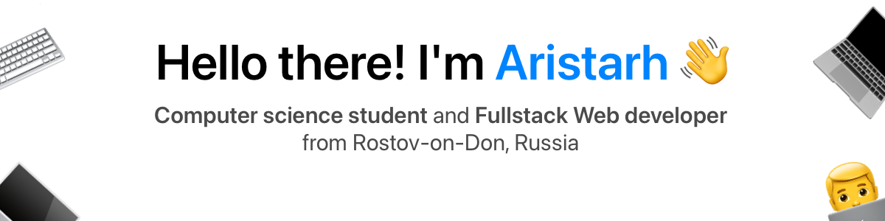

<!-- banner -->

&thinsp;

<!-- contacts -->

 <b>
  🖥️ <a href="https://chebupa.github.io">My personal website</a>
 </b>

 <b>
  📫 <a href="mailto: chebupadev@gmail.com">aristarh@shakulin.ru</a>
   
  
🌍 Russian (native), English (B2)

  
📄 <a href="assets/images/text/CV.pdf">CV</a>

 </b>

<h1></h1>

<!-- skills -->
<h3 align="center">
 <b>Programming languages and tools:</b>
</h3>

<!-- ios -->
<h4 align="center">iOS</h4>

  <!-- swift -->
  

<!-- frontend -->
<h4 align="center">Frontend</h4>

  <!-- react -->
  
  <!-- typescript -->
  
  <!-- js -->
  
  <!-- html -->
  
  <!-- css -->
  
  <!-- sass -->
  
  <!-- mui -->
  
  <!-- styled components -->
  
  <!-- emotion -->
  
  <!-- react query -->
  
  <!-- redux -->
  
  <!-- mobx -->
  
  <!-- storybook -->
  
  <!-- jest -->
  
  <!-- eslint -->
  
  <!-- vite -->
  
  <!-- npm -->
  
  <!-- yarn -->
  
  <!-- markdown -->
  

<!-- backend -->
<h4 align="center">Backend</h4>

  <!-- express -->
  
  <!-- nodejs -->
  
  <!-- typescript -->
  
  <!-- js -->
  
  <!-- postgresql -->
  
  <!-- prisma -->
  
  <!-- eslint -->
  
  <!-- npm -->
  
  <!-- yarn -->
  
  <!-- heroku -->
  

<!-- other -->
<h4 align="center">Other</h4>

  <!-- git -->
  
  <!-- docker -->
  

<!-- statistics -->

 
 

<h1></h1>

<!-- donation -->
<h3 align="center">Support my work</h3>

  

<!-- 
or
 -->

  

<!-- visitor count -->

 
  Visitor count 
  

